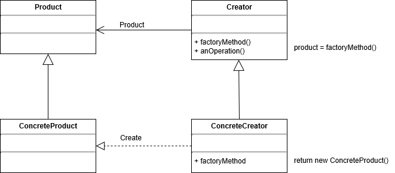
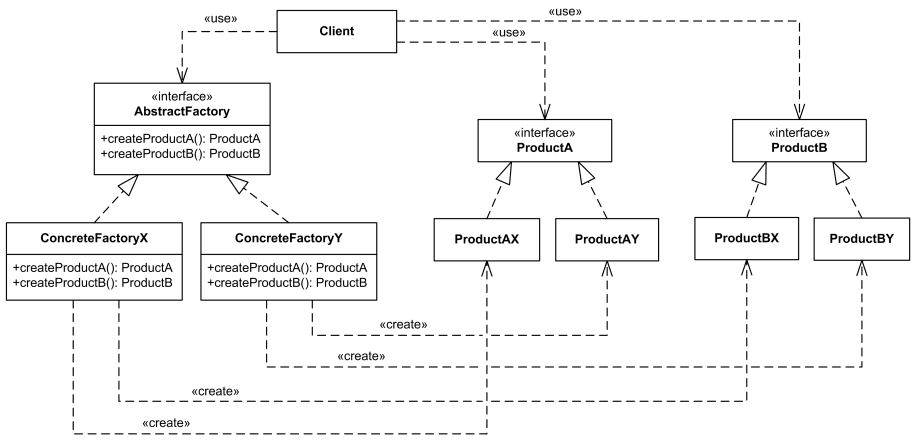
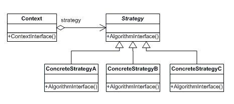

# 디자인 패턴

## 디자인 패턴이란?

- GoF(Gang of Four) 네 명의 학자가 기존의 많은 사례와 시스템등을 분석하여 좋은 설계라는 이런것이다 라는 23개 패턴을 제안
- 기존의 여러 시스템과 서비스를 기반으로 객체지향 프로그래밍에서 보다 유연하고, 확장성있는 설계가 가능한 예시를 제시

## 객체 지향 프로그래밍

- 추상화, 캡슐화, 상속, 다형성

## 객체 지향 디자인 원칙 (Object Oriented Design Principle)

- 애플리케이션의 달라지는 부분을 찾아내고, 달라지지 않는 부분과 분리한다. 새로운 요구사항이 있을때 마다 달라지는 부분은 분리해야 함
- 구현보다는 인터페이스에 맞춰서 프로그래밍 한다.
- 상속보다는 합성을 사용한다. (상속은 종속적이고 합성은 독립적이다)
- Abstract class(추상 클래스) vs Concrete class(구체 클래스)
- Interface Inheritance(인터페이스 기반 프로그래밍) vs Implementation Inheritance(구현체 기반 프로그래밍)

## SOLID 원칙

- 단일 책임의 원칙(Single Responseibility Principle) 하나의 클래스는 하나의 기능만을 구현하도록 한다. 즉, 어떤 클래스를 변경하는 이유는 하나이어야 한다 한 클래스에서 여러 기능을 제공하게 되면 유지보수가 어려움
- 개방 폐쇄의 원칙(Open-Closed Principle) : 객체 자신의 수정에 대해서는 유연하고, 다른 클래스가 수정될 때는 영향을 받지 않는다.
  인터페이스나 추상클래스를 통해 접근하도록 함
- 리스코프 치환 원칙(Liskov Subsititution Principle) : 상위 클래스와 하위 클래스는 항상 일관성이 있어야 하고, 하위 클래스는 항상 상위 클래스로 교체 될 수 있어야 한다.
  즉, 상위 클래스에 제공되는 여러 기능은 하위 클래스가 모두 사용가능 해야 한다.
  IS-A 관계, “is a kind of” 관계
- 의존 역전 원칙(Dependency Inversion Principle) : 의존 관계는 구체적인 것보다는 추상적인 것에 의존한다. 구체적인 것은 이미 구현이 되어있고 변하기 쉬운것, 추상적인 것은 인터페이스나 추상 클래스(상위 클래스)
- 인터페이스 분리 원칙(Interface Segregation Principle) : 제공하는 기능에 대한 인터페이스에만 종속적이어야 함. 만약 하나의 객체가 여러 기능을 제공해야 한다면 (단일 책임 원칙에 위배) 이때 클라이언트가 사용할 수 있는 여러 인터페이스로 분리하여 제공하면 클라이언트가 사용하지 않는 기능에 종속적이지 않을 수 있음

## 디자인 패턴은 규칙이 아닙니다.

- 언어에 종속적이지 않음
- 프레임 워크 개발에 적용될 수 있음
- 특정 영역에 종속적이지 않고 일반적으로 활용할 수 있음
- 좋은 설계에 대한 제안

## 왜 학습 하는가?

- 객체 지향을 위한 디자인 패턴은 소프트웨어의 중요한 요소(resuse, flexibility, extensibility, modularity)를 향상 시킴
- 소프트웨어 개발의 communication에 도움이 됨
- 좋은 설계는 좋은 소프트웨어나 오픈소스에 대해 학습하거나, 많은 경험과 연습에 의해 훈련될 수 있기에 디자인 패턴을 공부함으로써 이미 증명된 스킬과 경험을 배울수 있음
- 높은 결합도를 가지거나 알고리즘 종속성, 객체의 표현이나 구현에 종속적으로 구현된 소프트웨어의 리팩토링을 가능하게 함
- 결국 좋은 설계를 유도하여 소프트웨어의 유지보수에 들어가는 비용을 절약할 수 있음

# 리팩토링

## 리팩토링 이란?

- 외부에서 보는 프로그램의 기능은 변하지 않고 프로그램의 내부 구조를 개선하는것
- 프로그램의 동작이 변하지 않음을 증명하기 위해 유닛테스트가 중요함 테스트 → 리팩토링 → 테스트
- 디버깅은? 기능 추가는? 리팩토링이 아니다

## 리팩토링이 필요한 코드 : 코드에서 나는 악취(smell)

- 너무 긴 메서드 : 메서드가 너무 길다
- 방대한 클래스 : 클래스의 필드와 메서드가 너무 많다.
- 변경 발산(산탄총) : 기능의 변경시 많은 곳을 수정해야 한다.
- 속성, 조작 끼어들기 : 언제나 다른 클래스의 내용을 수정하게 하는 클래스가 있다.
- if, switch 문 : 반복적인 if나 switch문
- 과다한 매개 변수 : 메서드가 받는 매개 변수의 너무 많다.
- 기본 타입에 집착 “ 객체화 하지 않고, 기본타입만 사용한다.
- 게으른 클래스 : 하는 일이 없는 클래스
- 의심스러운 일반화 : 언젠가는 상속하겠지 하면서 만들어놓은 상위 클래스
- 메세지 연쇄 : 메서드 호출시 연쇄가 너무 길다.
- 너무 많은 주석 : 프로그램의 부족함을 주석으로 설명해 놓음

## 리팩토링을 하는 이유

- 코드를 알기 쉽고 디버깅 하기 쉽게 만들어 유지보수와 확장이 편리하게

## 리팩토링과 디자인 패턴

- 항상은 아니지만, 리팩토링을 할 때 디자인 패턴을 적용하는 경우가 종종 있음
- 리팩토링에 디자인 패턴을 활용해 봄으로써 설계시 확장성 있는 설계의 중요성을 학습하자.

# Factory Method

## 디자인 원리

- 구체적인 것에 의존하지 말고 추상적인 것에 의존한다
  - 객체 생성에 new 를 사용하여 구체 클래스 인스턴스를 생성하게 되면 대상의 인스턴스가 변경되었을 때 프로그램이 수정되어야 함
  - ex) Car car = new Car(”Sonata”); // 차종에 따라 여러 차가 생성될 수 있음
  - 여러 인스턴스가 다양하게 생성될 수 있는 상황에서는 팩토리 메서드를 사용한다.
  - 생성될 수 있는 여러 객체를 추상화 하고, 팩토리에서는 추상 클래스를 활용하고 생성하는 메서드를 제공한다. 클라이언트는 실제 인스턴스와 상관없이, 팩토리가 제공해주는 생성 메서드(예를 들어 createCar())를 사용하면 된다. 구체적인 클래스에 종속되지 않음

## 이전의 코드 (구체적인 클래스 기반의 코드)

*Car.java*

```java
package factory.before;

public class Car {
    public static final String SONATA = "Sonata";
    public static final String GRANDEUR = "Grandeur";
    public static final String GENESIS = "Genesis";

    String productName;

    public Car(String productName) {
        this.productName = productName;
    }

    public String toString() {
        return productName;
    }
}
```

*CarTest.java*

```java
package factory.before;

public class CarTest {
    public static void main(String[] args) {
        CarTest test = new CarTest();
        Car car = test.produceCar("Sonata");

        System.out.println(car);
    }

    public Car produceCar(String name) {

        Car car = null;

        if (name.equalsIgnoreCase(Car.SONATA)) {
            car = new Car(Car.SONATA);
        } else if (name.equalsIgnoreCase(Car.GRANDEUR)) {
            car = new Car(Car.GRANDEUR);
        } else if (name.equalsIgnoreCase(Car.GENESIS)) {
            car = new Car(Car.GENESIS);
        } else {
            car = new Car("noname");
        }

        return car;
    }
}
```

→ 분류코드를 사용함. 생성하는 인스턴스가 증가하면 코드가 점점 길어짐

## 간단한 팩토리로 리팩토링 하기

1. Car를 상위 클래스로 만들고 각각의 제품을 하위 클래스로 만든다.
2. 팩토리에서 인스턴스를 생성한다.

*Car.java*

```java
package factory.first;

public abstract class Car {
    String productName;

    public Car(String productName) {
        this.productName = productName;
    }

    public String toString() {
        return productName;
    }
}
```

`abstract` 직접 생성할 일이 없으므로 abstract 추상 클래스로 정의

*Sonata.java*

```java
package factory.first;

public class Sonata extends Car {

    public Sonata(String productName) {
        super(productName);
    }

}
```

*Genesis.java*

```java
package factory.first;

public class Genesis extends Car {

    public Genesis(String productName) {
        super(productName);
    }

}
```

*Grandeur.java*

```java
package factory.first;

public class Grandeur extends Car {

    public Grandeur(String productName) {
        super(productName);
    }

}
```

*CarFactory.java*

```java
package factory.first;

public class CarFactory {

    public Car createCar(String productName) {

        Car car = null;

        if (productName.equalsIgnoreCase("sonata")) {
            car = new Sonata(productName);
        } else if (productName.equalsIgnoreCase("genesis")) {
            car = new Genesis(productName);
        } else if (productName.equalsIgnoreCase("grandeur")) {
            car = new Grandeur(productName);
        }

        return car;
    }
}
```

*CarTest.java*

```java
package factory.first;

import factory.first.Car;

public class CarTest {
    public static void main(String[] args) {

        CarTest test = new CarTest();
        Car car = test.produceCar("Sonata");

        Car car2 = test.produceCar("genesis");

        System.out.println(car);
        System.out.println(car2);
    }

    public Car produceCar(String name) {

        Car car = null;

        CarFactory factory = new CarFactory();

        car = factory.createCar(name);

        return car;
    }
}
```

## 팩토리를 추상화 하기

1. 팩토리를 추상화 하여 여러 팩토리가 상속받고 다양한 제품군을 만들 수 있다.
2. 팩토리에서 제품을 생성하는 과정이 다양한 공정과정을 거치게 되면 **템플릿 메서드 방식**을 사용할 수 있다.

*CarFactory.java*

```java
package factory.second;

public abstract class CarFactory {

    final public Car manufacturingCar(String name) {

        Car car;
        preparingOthers();
        car = createCar(name);
        washCar();

        return car;
    }

    public void preparingOthers() {
        System.out.println("preparingOthers");
    }

    public void washCar() {
        System.out.println("washCar");
    }

    public abstract Car createCar(String name);
}
```

`abstract` CarFactory 를 추상 클래스로 변경

*HyundaiFactory.java*

```java
package factory.second;

public class HyundaiFactory extends CarFactory {

    public Car createCar(String productName) {

        Car car = null;

        if (productName.equalsIgnoreCase("sonata")) {
            car = new Sonata(productName);
        } else if (productName.equalsIgnoreCase("genesis")) {
            car = new Genesis(productName);
        } else if (productName.equalsIgnoreCase("grandeur")) {
            car = new Grandeur(productName);
        }

        return car;
    }
}
```



- 상위 클래스에서 추상 팩토리 메서드를 제공하고 하위 클래스에서 이를 구현하여 구체 클래스를 생성한다. 따라서 클라이언트가 사용하게 되는 상위 메서드는 추상화되어 있고, 실제 객체가 생성되는 하위 클래스와 분리되어 유연성이 제공된다.

# Abstract Factory Method

## 디자인 원리

- 서로 연관성이 있는 여러 인스턴스를 한꺼번에 생성하기 위한 팩토리 패턴
- 추상화된 인터페이스를 팩토리에 제공하고 상황에 따라 그에 맞는 인스턴스들이 생성되도록 한다.
  가령 데이터베이스에 따라 DAO 클래스가 달라져야 한다고 할 때, 현재 사용해야 하는 DB의 종류에 따른 DAO 인스턴스를 한꺼번에 생성하도록 한다.
- 다양한 세트가 존재하고 이를 대체할 수 있도록 구현한 패턴

## class diagram



- 대체로 ConcreteFactory 인스턴스는 실행할 때 만들어짐
- ConcreteFactory는 각 제품 세트를 생성함
- Client는 AbstractFactory와 AbstractProduct 클래스에 선언된 인터페이스를 사용한다.

*UserInfo.java*

```java
package abstractfactory.domain.userinfo;

public class UserInfo {

    private String userId;
    private String userName;
    private String password;

    public String getUserId() {
        return userId;
    }

    public void setUserId(String userId) {
        this.userId = userId;
    }

    public String getUserName() {
        return userName;
    }

    public void setUserName(String userName) {
        this.userName = userName;
    }

    public String getPassword() {
        return password;
    }

    public void setPassword(String password) {
        this.password = password;
    }
}
```

→ `UserInfo` 도메인

*UserInfoDao.java*

```java
package abstractfactory.domain.userinfo.dao;

import abstractfactory.domain.userinfo.UserInfo;

public interface UserInfoDao {

    public void insertUserInfo(UserInfo userInfo);
    public void deleteUserInfo(UserInfo userInfo);
    public void updateUserInfo(UserInfo userInfo);

}
```

→ DB 타입에 맞게 Dao가 변경되기 때문에 인터페이스로 생성

*UserInfoMysqlDao.java*

```java
package abstractfactory.domain.userinfo.dao.mysql;

import abstractfactory.domain.userinfo.UserInfo;
import abstractfactory.domain.userinfo.dao.UserInfoDao;

public class UserInfoMysqlDao implements UserInfoDao {

    @Override
    public void insertUserInfo(UserInfo userInfo) {
        System.out.println("insert into MySQL DB userId = " + userInfo.getUserId());
    }

    @Override
    public void deleteUserInfo(UserInfo userInfo) {
        System.out.println("delete into MySQL DB userId = " + userInfo.getUserId());
    }

    @Override
    public void updateUserInfo(UserInfo userInfo) {
        System.out.println("update into MySQL DB userId = " + userInfo.getUserId());
    }
}
```

*UesrInfoOracleDao.java*

```java
package abstractfactory.domain.userinfo.dao.oracle;

import abstractfactory.domain.userinfo.UserInfo;
import abstractfactory.domain.userinfo.dao.UserInfoDao;

public class UserInfoOracleDao implements UserInfoDao {

    @Override
    public void insertUserInfo(UserInfo userInfo) {
        System.out.println("insert into ORACLE DB userId = " + userInfo.getUserId());
    }

    @Override
    public void deleteUserInfo(UserInfo userInfo) {
        System.out.println("delete into ORACLE DB userId = " + userInfo.getUserId());
    }

    @Override
    public void updateUserInfo(UserInfo userInfo) {
        System.out.println("update into ORACLE DB userId = " + userInfo.getUserId());
    }
}
```

*Product.java*

```java
package abstractfactory.domain.product;

public class Product {

    private String productId;
    private String productName;

    public String getProductId() {
        return productId;
    }

    public void setProductId(String productId) {
        this.productId = productId;
    }

    public String getProductName() {
        return productName;
    }

    public void setProductName(String productName) {
        this.productName = productName;
    }
}
```

*ProductDao.java*

```java
package abstractfactory.domain.product.dao;

import abstractfactory.domain.product.Product;

public interface ProductDao {

    public void insertProduct(Product product);
    public void deleteProduct(Product product);
    public void updateProduct(Product product);

}
```

*ProductMysqlDao.java*

```java
package abstractfactory.domain.product.dao.mysql;

import abstractfactory.domain.product.Product;
import abstractfactory.domain.product.dao.ProductDao;

public class ProductMysqlDao implements ProductDao {

    @Override
    public void insertProduct(Product product) {
        System.out.println("insert into MySQL DB userId = " + product.getProductId());
    }

    @Override
    public void deleteProduct(Product product) {
        System.out.println("delete into MySQL DB userId = " + product.getProductId());
    }

    @Override
    public void updateProduct(Product product) {
        System.out.println("update into MySQL DB userId = " + product.getProductId());
    }
}
```

*ProductOracleDao.java*

```java
package abstractfactory.domain.product.dao.oracle;

import abstractfactory.domain.product.Product;
import abstractfactory.domain.product.dao.ProductDao;

public class ProductOracleDao implements ProductDao {

    @Override
    public void insertProduct(Product product) {
        System.out.println("insert into ORACLE DB userId = " + product.getProductId());
    }

    @Override
    public void deleteProduct(Product product) {
        System.out.println("delete into ORACLE DB userId = " + product.getProductId());
    }

    @Override
    public void updateProduct(Product product) {
        System.out.println("update into ORACLE DB userId = " + product.getProductId());
    }
}
```

*DaoFactory.java*

```java
package abstractfactory.factory;

import abstractfactory.domain.product.dao.ProductDao;
import abstractfactory.domain.userinfo.dao.UserInfoDao;

public abstract class DaoFactory {

    public abstract UserInfoDao createUserInfoDao();
    public abstract ProductDao createProductDao();
}
```

→ 추상 클래스로 생성하여 DB 타입에 맞게 Dao 인스턴스를 생성하도록 메소드만 선언

*MysqlDaoFactory.java*

```java
package abstractfactory.factory;

import abstractfactory.domain.product.dao.ProductDao;
import abstractfactory.domain.product.dao.mysql.ProductMysqlDao;
import abstractfactory.domain.userinfo.dao.UserInfoDao;
import abstractfactory.domain.userinfo.dao.mysql.UserInfoMysqlDao;

public class MySqlDaoFactory extends DaoFactory {

    @Override
    public UserInfoDao createUserInfoDao() {
        return new UserInfoMysqlDao();
    }

    @Override
    public ProductDao createProductDao() {
        return new ProductMysqlDao();
    }
}
```

*OracleDaoFactory.java*

```java
package abstractfactory.factory;

import abstractfactory.domain.product.dao.ProductDao;
import abstractfactory.domain.product.dao.oracle.ProductOracleDao;
import abstractfactory.domain.userinfo.dao.UserInfoDao;
import abstractfactory.domain.userinfo.dao.oracle.UserInfoOracleDao;

public class OracleDaoFactory extends DaoFactory {

    @Override
    public UserInfoDao createUserInfoDao() {
        return new UserInfoOracleDao();
    }

    @Override
    public ProductDao createProductDao() {
        return new ProductOracleDao();
    }
}
```

*db.properties*

```
DB_TYPE=ORACLE
```

*UserInfoClient.java*

```java
package abstractfactory.client;

import abstractfactory.domain.product.Product;
import abstractfactory.domain.product.dao.ProductDao;
import abstractfactory.domain.userinfo.UserInfo;
import abstractfactory.domain.userinfo.dao.UserInfoDao;
import abstractfactory.factory.DaoFactory;
import abstractfactory.factory.MySqlDaoFactory;
import abstractfactory.factory.OracleDaoFactory;

import java.io.FileInputStream;
import java.io.IOException;
import java.util.Properties;

public class UserInfoClient {

    public static void main(String[] args) throws IOException {
        FileInputStream fis =
                new FileInputStream(
                        "C:\\Users\\ehdwn\\study\\DesignPattern\\src\\main\\resources\\db.properties"
                );
        Properties prop = new Properties();
        prop.load(fis);

        String dbType = prop.getProperty("DB_TYPE");

        UserInfo userInfo = new UserInfo();
        userInfo.setUserId("12345");
        userInfo.setPassword("!@#$%");
        userInfo.setUserName("테스트");

        Product product = new Product();
        product.setProductId("0011AA");
        product.setProductName("TV");

        DaoFactory daoFactory = null;
        UserInfoDao userInfoDao = null;
        ProductDao productDao = null;

        if (dbType.equals("ORACLE")) {
            daoFactory = new OracleDaoFactory();
        } else if (dbType.equals("MYSQL")) {
            daoFactory = new MySqlDaoFactory();
        } else {
            System.out.println("db support error");
            return;
        }

        userInfoDao = daoFactory.createUserInfoDao();
        productDao = daoFactory.createProductDao();

        System.out.println("==USERINFO TRANSACTION==");
        userInfoDao.insertUserInfo(userInfo);
        userInfoDao.deleteUserInfo(userInfo);
        userInfoDao.updateUserInfo(userInfo);

        System.out.println("==PRODUCT TRANSACTION==");
        productDao.insertProduct(product);
        productDao.deleteProduct(product);
        productDao.updateProduct(product);
    }
}
```

*결과*

```
==USERINFO TRANSACTION==
insert into ORACLE DB userId = 12345
delete into ORACLE DB userId = 12345
update into ORACLE DB userId = 12345
==PRODUCT TRANSACTION==
insert into ORACLE DB userId = 0011AA
delete into ORACLE DB userId = 0011AA
update into ORACLE DB userId = 0011AA
```

> 이렇게 코드를 작성하면 이후에 DB가 추가되었을 때 Dao 세트와 Factory만 추가해주면 클라이언트 코드에서는 수정할 게 없다.

# Singleton

## 디자인 원리

- 클래스의 인스턴스가 오직 하나만이 존재해야 하고, 이에 대한 접근도 동일한 인터페이스를 통해 가능
- 인스턴스가 여러 개가 되면 오류가 생길 수 있고, 불필요한 자원들이 생성되고, 일관성이 없어지는 일이 발생하는 경우 (Calendar, Logger, Connection poll, 레지스트리 설정, 학교 등등…)
- 전역 변수를 쓰는 것은 안 좋은 프로그래밍 방법
- 자바에서는 static 키워드를 활용함

## **간단한 Singleton 예제 : 게으른 인스턴스 생성 (lazyinstantiation)**

*Singleton.java*

```java
package singleton;

public class Singleton {

    private static Singleton instance;

    private Singleton() {

    }

    public static Singleton getInstance() {
        if (instance == null) {
            instance = new Singleton();
        }
        return instance;
    }
}
```

*SingletonTest.java*

```java
package singleton;

import java.util.Calendar;

public class SingletonTest {

    public static void main(String[] args) {

        Singleton singletonA = Singleton.getInstance();
        Singleton singletonB = Singleton.getInstance();

        if (singletonA == singletonB) {
            System.out.println("true");
        } else {
            System.out.println("false");
        }

        Calendar calendar = Calendar.getInstance();
    }
}
```

*결과*

```
true
```

## **multi-thread 에서는 Singleton 패턴에서도 두 개의 인스턴스가 생성될 수 있음**

- 두 thread 모두 instance == null 에서 switch가 발생하면 두 개의 instance가 생성됨
- thread-safe를 보장하는 코드

**해결 방법**

### 1. 동기화 방식

*Singleton.java*

```java
package singleton;

public class Singleton {

    private static Singleton instance;

    private Singleton() {

    }

    public static synchronized Singleton getInstance() {
        if (instance == null) {
            instance = new Singleton();
        }
        return instance;
    }
}
```

→ 매번 동기화에 대한 overhead 가 발생할 수 있음

### 2. 인스턴스를 처음부터 생성

*Singleton.java*

```java
package singleton;

public class Singleton {

    private static Singleton instance = new Singleton();

    private Singleton() {

    }

    public static Singleton getInstance() {
        return instance;
    }
}
```

→ 인스턴스를 사용하는 시점에 생성하는 것보다는 overhead 가능성이 낮다.

### 3. DCL (Double-Checked Locking) 방법

*Singleton.java*

```java
package singleton;

public class Singleton {

    private static Singleton instance;

    private Singleton() {

    }

    public static Singleton getInstance() {
        
        if (instance == null) {
            synchronized (Singleton.class) {
                instance = new Singleton();
            }
        }
        return instance;
    }
}
```

→ instance가 null일 때만 동기화를 하므로 overhead 가능성이 적다.

# Strategy

## 디자인 의도

- 다양한 기능과 알고리즘이 조건에 따라 상황에 따라 적용되어야 하는 경우
- 여러 클래스에 정책(알고리즘)이 적용되어야 할 때 각각 구현하게 되면 낭비이고, 한꺼번에 구현하면 수정하기 어렵다.
- 인터페이스로 분리하고 적절한 기능이 적용될 수 있도록 하여 실제 사용하는 쪽과 알고리즘의 적용이 분리되도록 한다.
- 실행 중에 선택될 수 있고, UI나 로직의 조건에 따라 다른 기능이 적용될 수 있는 유연함을 가진다.
- 인터페이스에 선언된 기능을 구현한 다양한 정책이 다른 클래스들에 영향을 주지 않고 추가, 삭제될 수 있으므로 유지 보수가 용이하다.

## 클래스 다이어그램



## 예제

학교의 학생이 수강 신청을 하게 되면 과목마다 각각 성적을 받게 된다. 이때, 성적에 대한 학점을 부여하는 정책은 다음과 같이 여러가지가 있을 수 있다. 전공 관련 여부에 따라 학점이 다르게 부여되는 경우, Pass/Fail로만 학점을 부여하는 경우 등 다양한 학점에 대한 정책이 있을 때 각 성적에 대해 다양한 정책을 어떻게 구현하면 좋을까?

다음과 같은 조건일 때 학생의 학점을 출력해보자

**전공 과목인 경우의 학점 부여 방식**

| S | A | B | C | D | F |
| --- | --- | --- | --- | --- | --- |
| 95~100점 | 90~94점 | 80~89점 | 70~79점 | 55~69점 | 60점 미만 |

**비 전공 과목인 경우의 학점 부여 방식**

| A | B | C | D | F |
| --- | --- | --- | --- | --- |
| 90~100점 | 80~89점 | 70~79점 | 55~69점 | 55점 미만 |

| 이름 | 전공 과목 | 국어 | 수학 | 영어 |
| --- | --- | --- | --- | --- |
| Kim | 수학 | 100 | 100 |  |
| Lee | 국어 | 55 | 55 | 100 |

*Student.java*

```java
package strategy;

import strategy.grade.BasicGradeEvaluation;
import strategy.grade.GradeEvaluation;
import strategy.grade.MajorGradeEvaluation;

import java.util.ArrayList;

public class Student {

    int studentId;
    String studentName;
    ArrayList<Subject> subjectList;

    public static final int BASIC = 0;
    public static final int MAJOR = 1;

    public Student(int studentId, String studentName) {
        this.studentId = studentId;
        this.studentName = studentName;

        subjectList = new ArrayList<Subject>();
    }

    public void addSubject(String name, int score, boolean majorCode) {
        Subject subject = new Subject();

        subject.setName(name);
        subject.setScorePoint(score);
        subject.setMajorCode(majorCode);
        subjectList.add(subject);
    }

    public void showStudentScore() {
        int total = 0;
        for (Subject s : subjectList) {
            total += s.getScorePoint();
            System.out.println(
                    studentName + " 학생의 " + s.getName() + " 과목의 점수는 " +
                            s.getScorePoint() + "점 입니다."
            );
        }

        System.out.println(studentName + " 학생의 총점은 " + total + "점 입니다.");
    }

    public void showGradeInfo() {

        GradeEvaluation[] gradeEvaluation = {new BasicGradeEvaluation(), new MajorGradeEvaluation()};

        for (Subject s : subjectList) {

            String grade;

            if (s.isMajorCode()) {
                grade = gradeEvaluation[MAJOR].getGrade(s.getScorePoint());
            } else {
                grade = gradeEvaluation[BASIC].getGrade(s.getScorePoint());
            }
            System.out.println(
                    "학생 " + studentName + "의 " + s.getName() + " 과목 성적은 " +
                            s.getScorePoint() + "점 이고, 학점은 " + grade + " 입니다."
            );
        }
    }
}
```

→ `GradeEvaluation[] gradeEvaluation = {new BasicGradeEvaluation(), new MajorGradeEvaluation()};` **인터페이스 배열에 구현체를 정의하여 사용**

*Subject.java*

```java
package strategy;

public class Subject {

    private String name;
    private int scorePoint;
    private boolean majorCode;

    public String getName() {
        return name;
    }

    public void setName(String name) {
        this.name = name;
    }

    public int getScorePoint() {
        return scorePoint;
    }

    public void setScorePoint(int scorePoint) {
        this.scorePoint = scorePoint;
    }

    public boolean isMajorCode() {
        return majorCode;
    }

    public void setMajorCode(boolean majorCode) {
        this.majorCode = majorCode;
    }
}
```

*GradeEvaluation.java*

```java
package strategy.grade;

public interface GradeEvaluation {

    public String getGrade(int score);
}
```

*BasicGradeEvaluation.java*

```java
package strategy.grade;

public class BasicGradeEvaluation implements GradeEvaluation {
    @Override
    public String getGrade(int score) {

        String grade = null;

        if (score >= 90 && score <= 100) {
            grade = "A";
        } else if (score >= 80 && score <= 89) {
            grade = "B";
        } else if (score >= 70 && score <= 79) {
            grade = "C";
        } else if (score >= 55 && score <= 69) {
            grade = "D";
        } else {
            grade = "F";
        }
        return grade;
    }
}
```

*MajorGradeEvaluation.java*

```java
package strategy.grade;

public class MajorGradeEvaluation implements GradeEvaluation {
    @Override
    public String getGrade(int score) {

        String grade = null;

        if (score >= 95 && score <= 100) {
            grade = "S";
        } else if (score >= 90 && score <= 94) {
            grade = "A";
        } else if (score >= 80 && score <= 89) {
            grade = "B";
        } else if (score >= 70 && score <= 79) {
            grade = "C";
        } else if (score >= 60 && score <= 69) {
            grade = "D";
        } else {
            grade = "F";
        }
        return grade;
    }
}
```

*StudentTest.java*

```java
package strategy;

public class StudentTest {

    public static void main(String[] args) {
        Student studentLee = new Student(1001, "Lee");

        studentLee.addSubject("국어", 100, false);
        studentLee.addSubject("수학", 100, true);

        Student studentKim = new Student(1002, "Kim");

        studentKim.addSubject("국어", 55, true);
        studentKim.addSubject("수학", 55, false);
        studentKim.addSubject("영어", 100, false);

        studentLee.showStudentScore();
        System.out.println("=============================================");
        studentKim.showStudentScore();

        System.out.println("===================== GRADE ====================");
        studentLee.showGradeInfo();
        System.out.println("=============================================");
        studentKim.showGradeInfo();
    }

}
```

*결과*

```
Lee 학생의 국어 과목의 점수는 100점 입니다.
Lee 학생의 수학 과목의 점수는 100점 입니다.
Lee 학생의 총점은 200점 입니다.
=============================================
Kim 학생의 국어 과목의 점수는 55점 입니다.
Kim 학생의 수학 과목의 점수는 55점 입니다.
Kim 학생의 영어 과목의 점수는 100점 입니다.
Kim 학생의 총점은 210점 입니다.
===================== GRADE ====================
학생 Lee의 국어 과목 성적은 100점 이고, 학점은 A 입니다.
학생 Lee의 수학 과목 성적은 100점 이고, 학점은 S 입니다.
=============================================
학생 Kim의 국어 과목 성적은 55점 이고, 학점은 F 입니다.
학생 Kim의 수학 과목 성적은 55점 이고, 학점은 D 입니다.
학생 Kim의 영어 과목 성적은 100점 이고, 학점은 A 입니다.
```

# Bridge

## 디자인 원리

- 기능(추상)의 계층과 구현의 계층을 분리하여 독립적으로 확장하도록 한다.
  - 기능 → 추상, 개념
- 하나의 기능에 대한 다양한 구현이 적용될 수 있다.
- 기능과 구현부가 혼재하면 상속 관계가 복잡해진다
  - 기능적인 부분도 상속이 일어날 수 있다.
  - 구현한 부분도 계층 구조가 일어날 수 있다.
  - 기능적인 부분에서도 확장이 일어나고 구현한 부분에서도 확장이 일어나 구분이 잘 되지 않는다.
- **분리하고 기능이 구현에 대한 참조를 가지게 하여 실제 구현을 선택할 수 있다. - Bridge**
  - Bridge 패턴은 개념적인 부분의 확장, 구현적인 부분의 확장을 구분하여 따로 두고 실제적인 implementation은 기능 쪽에서 가지고 있게 하는 방식이다.
- 기능과 구현을 분리함으로써 낮은 결합도를 가지고, 기능이 구현에 종속되지 않는다.
- 실행 중에 구현부를 선택할 수 있고, 구현이 변경되더라도 기능에 대한 재컴파일이 필요 없다.
- 클라이언트는 기능 인터페이스를 사용하므로 구현에 대한 부분은 숨길 수 있다.

## 클래스 다이어그램


## 프로그램 예제

- List는 선형 자료의 추상적인 개념이고, List 하위에 Stack 과 Queue라는 추상적인 개념이 추가 될 수 있음
- 실제 List는 Array와 LinkedList로 구현될 수 있음
- 따라서 하나의 Stack이라는 기능은 Array, LinkedList로 구현 가능함
- Bridge 패턴을 활용해보자

*List.java(기능)*

```java
package bridge.list;

import bridge.impl.AbstractList;

public class List<T> {
    AbstractList<T> impl;

    public List(AbstractList<T> list) {
        this.impl = list;
    }

    public void add(T obj) {
        impl.addElement(obj);
    }

    public T get(int i) {
        return impl.getElement(i);
    }

    public T remove(int i) {
        return impl.deleteElement(i);
    }

    public int getSize() {
        return impl.getElementSize();
    }
}
```

*AbstractList.java(구현)*

```java
package bridge.impl;

public interface AbstractList<T> {

    void addElement(T obj);

    T deleteElement(int i);

    T getElement(int i);

    public int insertElement(T obj, int i);

    public int getElementSize();
}
```

*Stack.java(기능)*

```java
package bridge.list;

import bridge.impl.AbstractList;

public class Stack<T> extends List<T> {

    public Stack(AbstractList<T> list) {
        super(list);
        System.out.println("Stack을 만듭니다.");
    }

    public void push(T obj) {
        impl.insertElement(obj, 0);
    }

    public T pop() {
        return impl.deleteElement(0);
    }

    public T peek() {
        return impl.getElement(0);
    }
}
```

*Queue.java(기능)*

```java
package bridge.list;

import bridge.impl.AbstractList;

public class Queue<T> extends List<T> {

    public Queue(AbstractList<T> list) {
        super(list);
        System.out.println("Queue를 만듭니다.");
    }

    public void enQueue(T obj) {
        impl.addElement(obj);
    }

    public T deQueue() {
        return impl.deleteElement(0);
    }
}
```

*ArrayImpl.java(구현)*

```java
package bridge.impl;

import bridge.impl.AbstractList;

import java.util.ArrayList;

public class ArrayImpl<T> implements AbstractList<T> {

    ArrayList<T> array;

    public ArrayImpl() {
        array = new ArrayList<>();
        System.out.println("Array로 만듭니다.");
    }

    @Override
    public void addElement(T obj) {
        array.add(obj);
    }

    @Override
    public T deleteElement(int i) {
        return array.remove(i);
    }

    @Override
    public T getElement(int i) {
        return array.get(i);
    }

    @Override
    public int insertElement(T obj, int i) {
        array.add(i, obj);
        return i;
    }

    @Override
    public int getElementSize() {
        return array.size();
    }
}
```

*LinkedListImpl.java(구현)*

```java
package bridge.impl;

import bridge.impl.AbstractList;

import java.util.LinkedList;

public class LinkedListImpl<T> implements AbstractList<T> {

    LinkedList<T> linkedList;

    public LinkedListImpl() {
        linkedList = new LinkedList<>();
        System.out.println("LinkedList로 만듭니다.");
    }

    @Override
    public void addElement(T obj) {
        linkedList.add(obj);
    }

    @Override
    public T deleteElement(int i) {
        return linkedList.remove(i);
    }

    @Override
    public T getElement(int i) {
        return linkedList.get(i);
    }

    @Override
    public int insertElement(T obj, int i) {
        linkedList.add(i, obj);
        return i;
    }

    @Override
    public int getElementSize() {
        return linkedList.size();
    }
}
```

*ListTest.java(테스트)*

```java
package bridge.test;

import bridge.impl.ArrayImpl;
import bridge.impl.LinkedListImpl;
import bridge.list.Queue;
import bridge.list.Stack;

public class ListTest {
    public static void main(String[] args) {

        Queue<String> arrayQueue = new Queue<>(new ArrayImpl<>());

        arrayQueue.enQueue("aaa");
        arrayQueue.enQueue("bbb");
        arrayQueue.enQueue("ccc");

        System.out.println(arrayQueue.deQueue());
        System.out.println(arrayQueue.deQueue());
        System.out.println(arrayQueue.deQueue());
        System.out.println("===========================");

        Queue<String> linkedQueue = new Queue<>(new LinkedListImpl<>());

        linkedQueue.enQueue("aaa");
        linkedQueue.enQueue("bbb");
        linkedQueue.enQueue("ccc");

        System.out.println(linkedQueue.deQueue());
        System.out.println(linkedQueue.deQueue());
        System.out.println(linkedQueue.deQueue());
        System.out.println("===========================");

        Stack<String> arrayStack = new Stack<>(new ArrayImpl<>());

        arrayStack.push("aaa");
        arrayStack.push("bbb");
        arrayStack.push("ccc");

        System.out.println(arrayStack.pop());
        System.out.println(arrayStack.pop());
        System.out.println(arrayStack.pop());
        System.out.println("===========================");

        Stack<String> stackLinkedList = new Stack<>(new LinkedListImpl<>());

        stackLinkedList.push("aaa");
        stackLinkedList.push("bbb");
        stackLinkedList.push("ccc");

        System.out.println(stackLinkedList.pop());
        System.out.println(stackLinkedList.pop());
        System.out.println(stackLinkedList.pop());
        System.out.println("===========================");

    }
}
```

*결과*

```
Array로 만듭니다.
Queue를 만듭니다.
aaa
bbb
ccc
===========================
LinkedList로 만듭니다.
Queue를 만듭니다.
aaa
bbb
ccc
===========================
Array로 만듭니다.
Stack을 만듭니다.
ccc
bbb
aaa
===========================
LinkedList로 만듭니다.
Stack을 만듭니다.
ccc
bbb
aaa
===========================
```